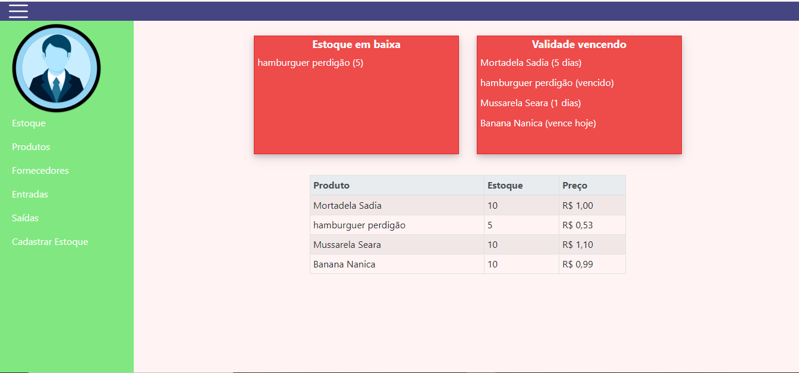

# Controle de Estoque

Minha primeira aplicação PHP orientada a objetos em que tive como base em outros códigos. Tem upload de imagem, CRUD dinâmico, login etc. Utiliza a estrutura MVC e o Mysql. No Front-end o Bootstrap 4 e Jquery.

# Funcionalidades

<ul>
	<li>Inseri, atualiza e deleta produtos e fornecedores.</li>
	<li>Upload de imagens de produtos</li>
	<li>Pode inserir várias entradas de um produto de diferentes fornecedores.</li>
	<li>O valor total de entradas e a quantidade de entradas.</li>
	<li>O valor total de saídas e a quantidade total de saídas.</li>
	<li>Sistema de busca de produtos, fornecedores, cidade. Busca de produtos em entradas e saídas.</li>
	<li>Notifica no painel inicial os produtos que falta 7 dias para validade vencer.</li>
</ul>

## Install

<ol>
	<li>A url base do sistema <strong>https://localhost/controle_de_estoque</strong> esta em index.php caso queira alterar</li>
	<li>Insira as configurações do seu banco de dados como nome do banco em: <strong>Core/Config.php</strong></li>
	<li>O arquivo com o sql para criar o banco de dados e as tabelas estão em: <strong>info_sql.sql</strong></li>
</ol>